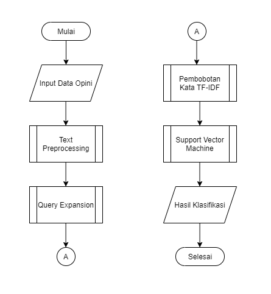
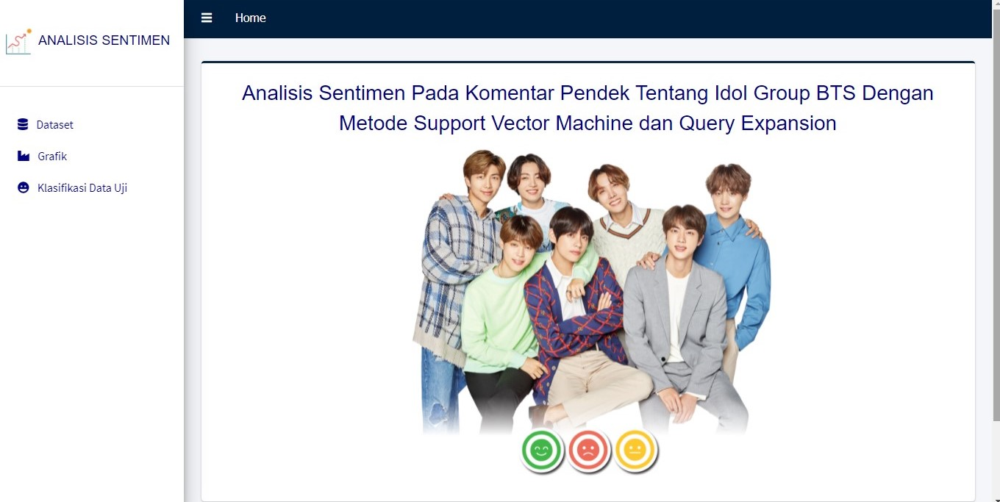
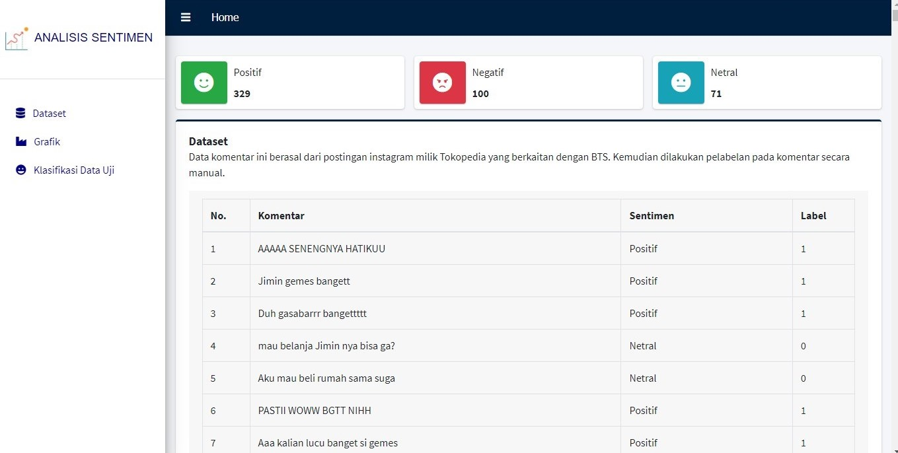
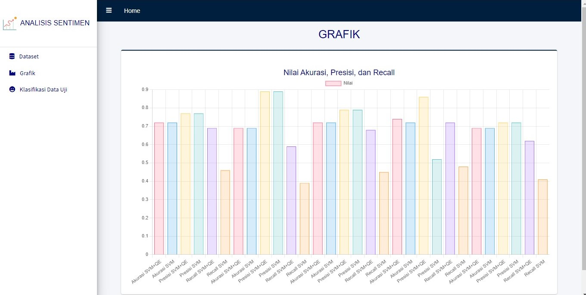
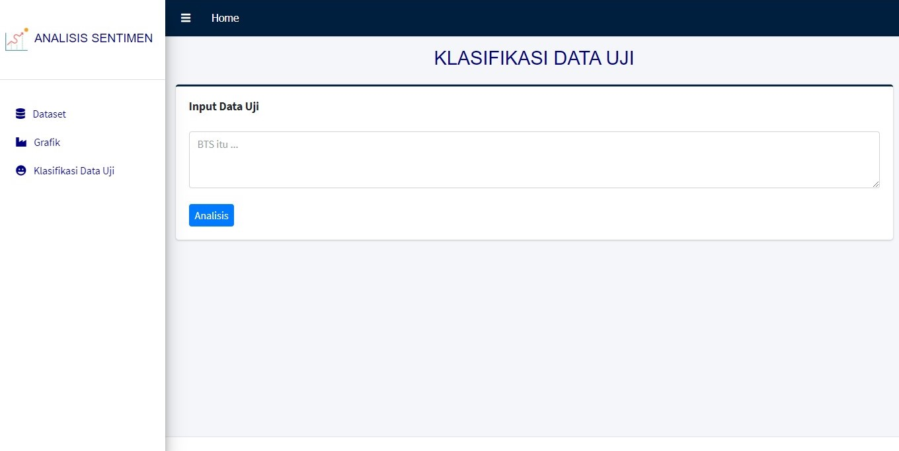
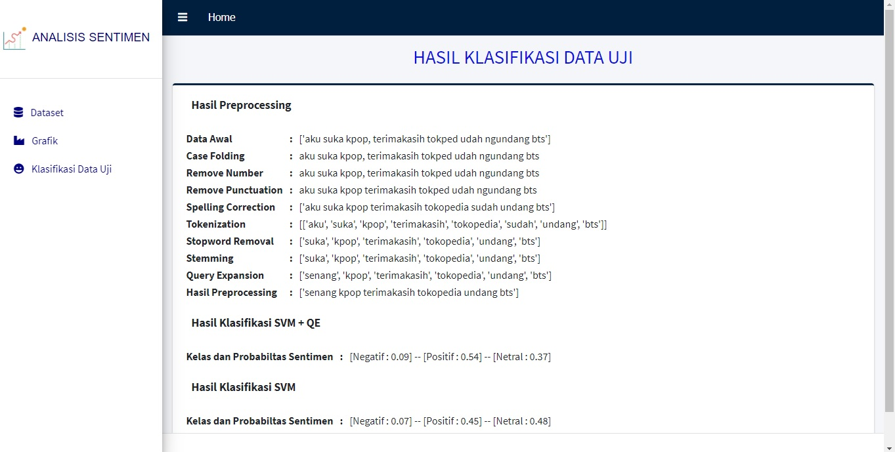

# Sentiment Analysis BTS

Project ini memiliki tujuan untuk mengetahui nilai sentimen dari setiap komentar instagram tentang idol group BTS. Output dari project ini adalah sebuah sistem yang dapat melakukan analisis pada tiap sentimen yang diinput.  

Tahapan dari analisis ini dapat dilihat pada flowchart berikut : 

Untuk data komentar yang dijadikan sebagai data latih dan data uji diambil dari beberapa postingan instagram Tokopedia mengenai BTS secara acak. Komentar-komentar tersebut diambil dengan metode _scraping_.

Jumlah data set yang digunakan yaitu 500 data, dengan data latih berjumlah 400 data dan data uji 100 data. 

Berikut penjelasan dari proses-proses yang dilakukan dalam menyelesaikan project.

#### 1. _Scraping_ Komentar pada Instagram Tokopedia
Untuk melakukan _scraping_ ini dibutuhkan _username_ dan _password_ instagram aktif serta _link_ dari postingan yang ingin diambil komentarnya. Output dari proses ini yaitu dalam bentuk _file_ CSV.

#### 2. Pelabelan / _Labelling_
Tahap ini akan memberika label pada tiap sentimen / komentar dari hasil _scraping_. Dimana komentar akan dilabeli dalam 3 kategori sentimen yaitu positif, negatif, dan netral. Oleh karena sentimen terdiri dari 3 jenis kategori, maka analisis ini termasuk ke dalam analisis pada sentimen _multiclass_. Karena dilakukan pelabelan, project ini termasuk ke dalam jenis _supervised learning_.

#### 3. _Text Preprocessing_
Proses ini akan membersihkan data yang telah dilakukan pelabelan. _Text preprocessing_ yang dilakukan terdiri dari _case folding_, _remove number_, _remove punctuation_, _stopword removal_, _spelling correction_, _tokenization_, dan _stemming_. 

#### 4. _Query Expansion_
Metode ini digunakan untuk melakukan perluasan pada _term_ / kata pada data komentar. Tujuannya yaitu agar kata yang awalnya tidak terdapat pada data uji atau bernilai 0 kemudian dilakukan _query expansion_, maka kata tersebut menjadi bernilai 1 sesuai dengan kata yang terdapat pada data latih.

#### 5. Pembobotan TF-IDF
Proses ini akan melakukan perhitungan pada tiap kata yang terdapat pada data set. Kemudian tiap kata tersebut akan dinotasikan ke dalam bentuk _vector_ mengingat metode _support vector machine_ memproses data berupa angka.

#### 6. _Support Vector Machine_
Metode SVM merupakan salah metode yang digunakan dalam melakukan klasifikasi. Beberapa jurnal membuktikan bahwa metode ini cocok untuk melakukan klasifikasi pada data berupa teks. Dalam melakukan klasifikasi metode ini akan mencari nilai _hyperplane_ terbaik yang mendekati nilai kebenaran dari sentimen. Output dari klasifikasi ini yaitu berupa nilai sentimen (positif, negatif, netral) beserta dengan probabilitas dari masing-masing sentimen. Akurasi yang dihasilkan dari project ini yaitu sebesar 74% pada saat pengujian menggunakan metode SVM dan QE, lalu akurasi sebesar 72% pada saat pengujian menggunakan metode SVM tanpa QE. 

Untuk sistem yang dibuat pada project ini dapat dilihat pada gambar-gambar berikut :

#### 1. Halaman Utama
Halaman ini menampilkan gambaran dari project yang dilakukan.

#### 2. Halaman Dataset
Contoh dari dataset yang digunakan pada project ditampilkan pada halaman ini.

#### 3. Halaman Grafik
Nilai akurasi, presisi, dan _recall_ dari pengujian yang dilakukan, ditampilkan pada halaman ini. Dimana pengujian dilakukan sebanyak 5 kali dengan menggunakan _5-fold cross validation_.

#### 4. Halaman Klasifikasi Data Uji
Ketika ingin mengetahui nilai sentimen dari sebuah komentar, maka dapat dilakukan input kalimat pada form yang tersedia pada halaman ini.

#### 4. Halaman Hasil Klasifikasi Data Uji
Kalimat yang telah diinput pada halaman klasifikasi, kemudian hasilnya akan ditampilkan pada halaman ini.

# 
### Thank you!
